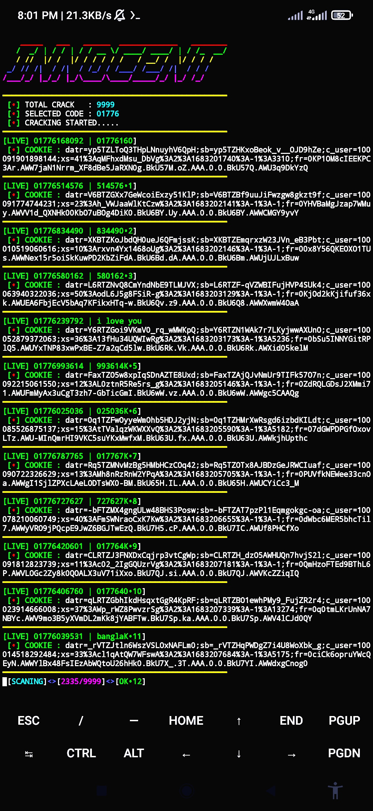

<h2>COMMAND_RUN 🔻 </h2>

[](https://git.io/typing-svg)

```
pkg update && pkg upgrade
pkg install git
pkg install python
pip install requests
pip install futures
pip install mechanize
pip install rich
pip install bs4

rm -rf RANDOM-CRACK
git clone https://github.com/MUMIT-404-CYBER/RANDOM-CRACK
cd RANDOM-CRACK
python Fire.py
```

___This Tools is Free Enjoy Dear User.___</br>

## CRACKING_SCREENSHOT :
<br>
<p align="center">

</p>
